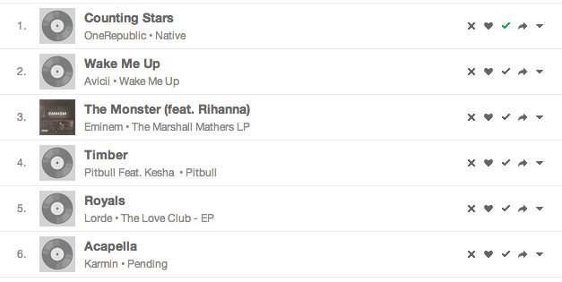

#Blacklist for Grooveshark

##Why?

When I'm playing random playlists (like popular, or random songs), sometimes I would avoid several songs I don't like too much. For this reason I created this bookmarklet. You can ban the songs you don't want to listen and shift to the next song automagically.

##Use

1) Copy this link like a bookmarklet:
``

2) Go www.grooveshark.com, for instance in your own playlist or popular list.

3) Click in the bookmarklet.

4) A new button with "x" icon appears in every song like this

5) ???

6) Profit!!!

##How it works
The plugin is split into different files, *blacklist-api.js* and *blacklist-ui.js*. The first one implements the required methods and the other creates a interface to use them.

##API
This plugin extends `window.Grooveshark` object) ([here the public API](http://developers.grooveshark.com/docs/js_api/)) with a new methods, so another developers can use the blacklist-api to develop another plugins.

- addSongInBlackListFromSongID
- getSongsInBlackList
- removeSongInBlackListFromSongID

##FAQ
###Why are you using Underscore/Lodash in your code?
I'm taking advantage of some libraries have been loaded for Grooveshark.com,like Lodash or jQuery are. I know they are using require.js and Backbone.js, although I don't want to use its versions - concretely they aren't using all the Backbone components.
###Are you using my account to save the blacklist?
Nope. I'm using your `window.localStorage` object to store the data. Don't worry: This information is just inside in your browser and it will never share with anyone.
###Using a bookmarklet all time is a bit tricky. Could you implement a Chrome/FF extension, please?
Well, I will try this if I have enough time in the near future. Feel free to implement this doing a pull request or creating another repo using the *blacklist-api.js*.

##The MIT License (MIT)

Copyright (c) <2013> <Francisco Cortés>

Permission is hereby granted, free of charge, to any person obtaining a copy
of this software and associated documentation files (the "Software"), to deal
in the Software without restriction, including without limitation the rights
to use, copy, modify, merge, publish, distribute, sublicense, and/or sell
copies of the Software, and to permit persons to whom the Software is
furnished to do so, subject to the following conditions:

The above copyright notice and this permission notice shall be included in
all copies or substantial portions of the Software.

THE SOFTWARE IS PROVIDED "AS IS", WITHOUT WARRANTY OF ANY KIND, EXPRESS OR
IMPLIED, INCLUDING BUT NOT LIMITED TO THE WARRANTIES OF MERCHANTABILITY,
FITNESS FOR A PARTICULAR PURPOSE AND NONINFRINGEMENT. IN NO EVENT SHALL THE
AUTHORS OR COPYRIGHT HOLDERS BE LIABLE FOR ANY CLAIM, DAMAGES OR OTHER
LIABILITY, WHETHER IN AN ACTION OF CONTRACT, TORT OR OTHERWISE, ARISING FROM,
OUT OF OR IN CONNECTION WITH THE SOFTWARE OR THE USE OR OTHER DEALINGS IN
THE SOFTWARE.